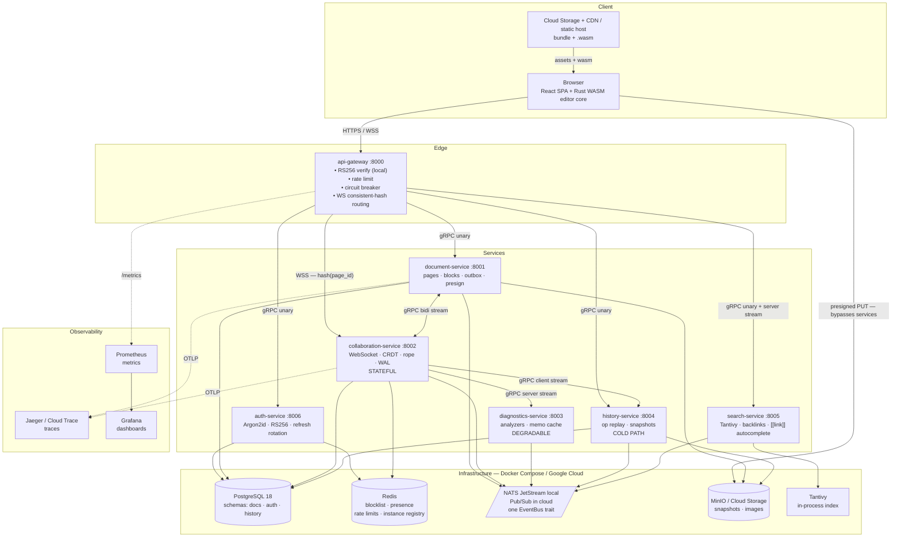
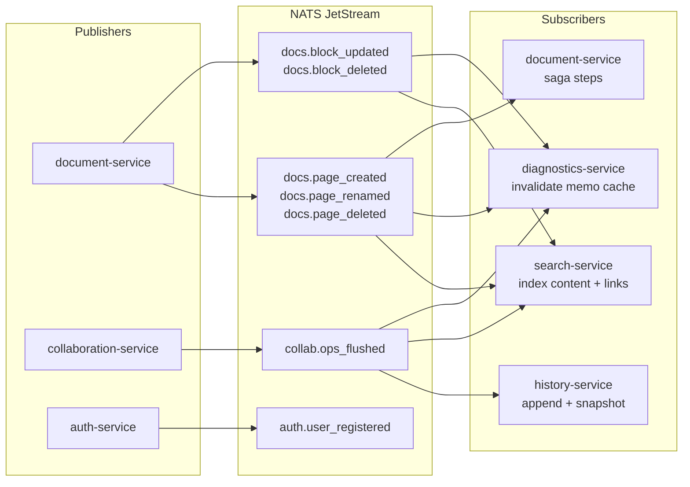
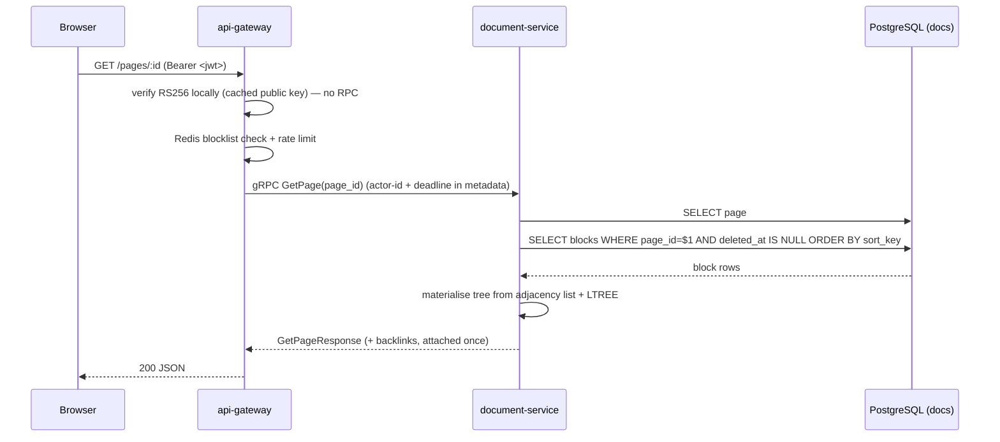
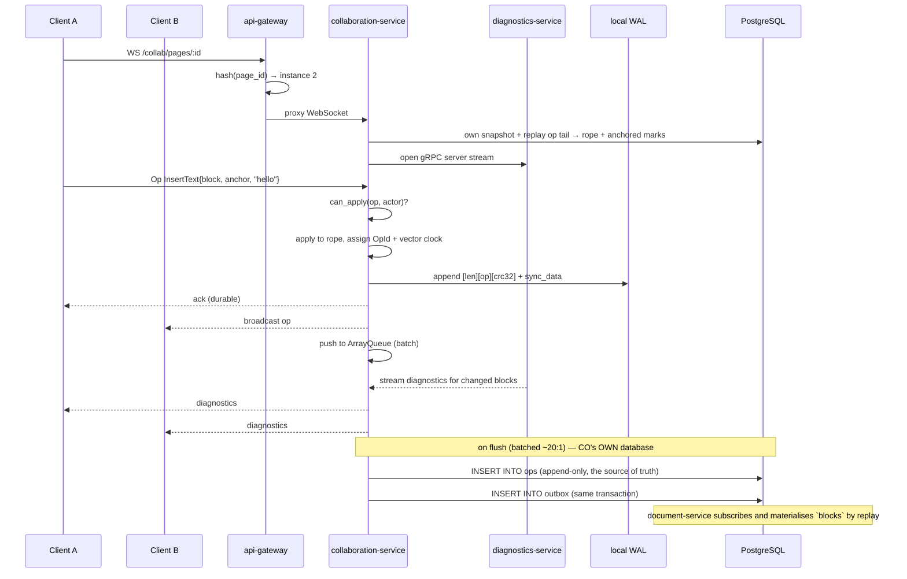

# Marginal — System Architecture

A self-hosted, real-time collaborative markdown notebook. Eleven Rust services (ADR-009), event-sourced on a CRDT operation log.

See ADR-001 for why each service boundary exists.

> **The map below shows the seven Track 1–3 services.** The four added by ADR-009 —
> `notification-service` (8007), `publishing-service` (8008), `plugin-service` (8009) and
> `assistant-service` (8010) — are gated on the 🏁 and get drawn when they are built.
> `CLAUDE.md` § Services is the full eleven.

---

## 1. Service Map



### Service properties

| Service | State | Scales on | If it dies |
|---|---|---|---|
| `api-gateway` | none | RPS | Everything is down |
| `document-service` | none | read RPS | No page loads or saves |
| `collaboration-service` | **doc-actor — one doc, one owner** | **WS connection count** | That page's live editing stops until a new owner takes the lease; reads still work |
| `diagnostics-service` | memo cache (rebuildable) | CPU | **Nothing breaks — squiggles disappear** |
| `history-service` | none | replay volume | No version history; editing unaffected |
| `search-service` | Tantivy index on disk | query RPS | No search or link autocomplete |
| `auth-service` | none | login RPS | No new logins; existing tokens keep working until expiry |

Two distinct autoscaling strategies follow: `collaboration-service` on a custom WebSocket-connection metric, `diagnostics-service` on CPU.

### The shared infrastructure — where the real single points of failure are

The table above is about services, and services are the easy part: they are stateless or
per-page-isolated, so they fail in bounded ways. **The single points of failure are the three
pieces of infrastructure they share**, and each one needs a decided answer rather than an implied
one.

| Dependency | If it dies | Blast radius |
|---|---|---|
| **Redis** | **No lease can be acquired or renewed** → live editing stops **globally**, not per page. Blocklist unavailable. Rate limits unavailable | **The worst one.** It is on the live-editing hot path and there is no second source for a lease |
| **PostgreSQL** (single primary, three schemas) | No page reads or writes, no logins, no history projection. `collaboration-service` keeps serving from memory + WAL but **cannot flush**, so the WAL grows unbounded | Wide, and **also a coupling**: pool exhaustion or lock contention in one schema starves the other two — noisy-neighbour risk that logical isolation does not prevent |
| **The event bus** (NATS local, Pub/Sub cloud) | Outbox rows accumulate in Postgres — **durable, not lost**. Search goes stale, diagnostics go stale | **Correctly degradable.** This is what the outbox pattern bought |

**Two fail-behaviour decisions that follow, and they must go opposite ways:**

| Dependency lost | Correct behaviour | Why |
|---|---|---|
| **Redis, for the JWT blocklist** | **Fail open** — accept unrevoked-looking tokens | The cost is bounded by the access-token lifetime. Failing closed takes the whole system down because a *cache* is unavailable |
| **Redis, for the page-ownership lease** | **Fail closed** — refuse new sessions; existing sessions drain when their lease expires | You cannot distinguish *"Redis is down"* from *"someone else took the lease."* Continuing risks two owners writing one page, and that cost is **unbounded corruption**, not a bounded window |

> **That asymmetry is the lesson.** Fail-open and fail-closed are not a temperament; they follow
> from whether the cost of being wrong is bounded. A short access-token lifetime is what *makes*
> failing open affordable — which is why it is a security parameter, not a convenience one.

### The couplings that are not obvious from the diagram

| Coupling | Consequence |
|---|---|
| **One outbox and one poller per publishing service** | Each lives in that service's own database (ADR-003). A shared poller would be a coupling between publishers |
| **No service writes another's tables** | `collaboration-service` owns `ops`; `document-service` materialises `blocks` by replaying its events. The op log's owner is the only writer |
| **The grant is the schema boundary** | The resident deployment is one Postgres instance with a schema and login role per service (ADR-010 §3), so there is no network boundary between schemas — a cross-schema join fails on a permission error. A service that respects its grant is extractable to its own instance by changing a connection string |
| **`document-service` lags the live rope** | The remaining coupling, and it is deliberate: `blocks` is materialised by replay, so a page read during an active session may be stale. Read-your-writes reads from the doc-actor (`ROADMAP.md` § Distributed systems) |

### What is genuinely well decoupled

Worth naming, because it is the part that took a decision rather than an omission:

- **JWT verified locally at the gateway against cached JWKS.** `auth-service` being down does not
  break authenticated requests — only new logins. **The best decoupling decision in the project**,
  and the reason the service table can say "existing tokens keep working"
- **Outbox + the bus.** A publisher never waits on a subscriber, and an event survives a bus outage
  because it is a Postgres row first
- **Per-page failure isolation.** One owner dying costs one page, not the workspace
- **Four services are declared degradable** — diagnostics, notification, publishing, assistant
  (ADR-009). A missing squiggle is not an outage

### The open questions this audit leaves

Recorded rather than answered, because each is a Phase 10 decision and guessing now would be worse:

1. **Does a live session survive a Redis outage on its existing lease?** The fail-closed rule above says the session drains at lease expiry — confirm that is acceptable, or design a longer grace with a fencing check on every write
2. **Postgres HA** — Cloud SQL regional failover is a Terraform flag, not an architecture change. Decide at Phase 11 whether the learning project pays for it
3. **Should the outbox poller move out of `document-service`?** A shared poller, or one per writing service, removes the coupling in the table above
4. **What does `collaboration-service` do when `diagnostics-service` is unreachable?** It must be *degradation*, not an error — verify the gRPC stream failure path does not surface to the editing session

---

## 2. Event Bus — Publishers and Subscribers

Every state mutation publishes a domain event. Subscribers react without coupling to the publisher.



**All delivery is at-least-once.** Every subscriber dedupes on `OpId` or event id (RFC-002 §4). `docs.page_renamed` is the expensive one — it invalidates diagnostics across every page that links to the renamed page (RFC-003 §4).

---

## 3. Request Flow — Loading a Page



---

## 4. Request Flow — Live Editing



The client is acknowledged after the **local WAL sync**, not after Postgres. Durability without paying database latency per keystroke.

**Session open is a replay, and it reads only this service's own database.** Loading
`document-service`'s `blocks` would put that service's availability on the path to *starting an
edit*, undoing the isolation ADR-003 bought. So `collaboration-service` snapshots its
own rope periodically and starts from *its* snapshot plus its own op tail.

**Build neither snapshot system at Phase 3.** Two cheaper things come first, in order:

| | |
|---|---|
| **1. Keep the doc-actor warm** for a few minutes after the last client leaves | The common case is a tab closed and reopened seconds later. Free, no storage, and it removes most reopen cost |
| **2. Replay from zero** on a cold start | A page with 10k ops replays in milliseconds. Snapshots only earn their place on genuinely long-lived pages |
| **3. Snapshot — only when a profile says session-open is slow** | Same discipline as the naive index before Tantivy, the DP table before Myers, O(n²) before Barnes–Hut |

When it *is* justified, two snapshot systems is the right answer rather than duplication, because the
access patterns genuinely differ: **this one is a hot sequential resume; `history-service`'s Parquet
is cold random point-in-time access, chosen so a snapshot is analysable without restoring it**
(`DATA_MODEL.md` § Snapshot format). Decoding columnar data back into a rope is the wrong shape for
the resume path.

**`blocks` is not written on this path.** `collaboration-service` appends to its own `ops` table and
publishes; `document-service` materialises `blocks` by replaying those events (ADR-003).
So the projection is eventually consistent by construction — which `RFC-001` §2 already required
(*the JSONB is a checkpoint, not the truth*) and which is why read-your-writes reads from the
doc-actor rather than the projection.

---

## 5. Saga — Page Deletion

Choreographed, no central coordinator. Four services, no shared database.

```
   DELETE /pages/:id
        │
        ▼
   document-service marks page `deleting`, publishes docs.page_deleted
        │
        ├─▶ collaboration-service  close sessions, drop rope  ──▶ collab.page_released
        ├─▶ search-service         delete index segments      ──▶ search.page_purged
        ├─▶ diagnostics-service    invalidate + re-analyse referrers
        └─▶ history-service        seal op log (retain)       ──▶ history.page_sealed
        │
        ▼  acks received, or timeout
   document-service hard-deletes rows
```

**Compensation is forward-only.** Search segments cannot be un-deleted, so a partial failure is resolved by retrying to completion rather than rolling back. `deleting` is a persisted state, so a crash mid-saga resumes rather than restarts.

---

## 6. Service Internals

`PROJECT_STRUCTURE.md` is authoritative. Summary: **feature-first vertical slices**, not layer-first directories.

```
        ╔═══════════════════════════════════════════════╗
        ║  crates/domain — ids, block kinds, ops, events   ║
        ║       ZERO external dependencies (wasm32)      ║
        ╚══════════════════════▲════════════════════════╝
                               │ depends on
      ┌────────────────────────┼────────────────────────┐
┌─────┴──────┐        ┌────────┴───────┐       ┌────────┴──────┐
│  pages/    │        │    blocks/     │       │    tree/      │
│ model.rs   │        │   model.rs     │       │  service.rs   │
│ repo.rs    │◄trait +│   repo.rs      │       │  LTREE walk,  │
│ handlers.rs│ impl,  │   handlers.rs  │       │  cascade      │
└─────┬──────┘ 1 file └────────┬───────┘       └────────┬──────┘
      └────────────────────────┼────────────────────────┘
                     ┌─────────▼──────────┐
                     │ routes · state     │
                     │ error  · main      │
                     └────────────────────┘
```

Every external dependency sits behind a trait declared in the **same file** as its implementation. `crates/domain` has zero external dependencies — required because `crates/diagnostics` and the editor core compile to `wasm32`.

---

## 7. Local Stack

| Container | Image | Port | Used by |
|---|---|---|---|
| `postgres` | `postgres:18-alpine` | 5432 | auth, document, history |
| `redis` | `redis:7-alpine` | 6379 | gateway, auth, collaboration |
| `nats` | `nats:2` (JetStream) | 4222 | all publishers/subscribers |
| `minio` | `minio/minio` | 9000 | document (images), history (snapshots) |
| `jaeger` | `jaegertracing/all-in-one` | 16686 | all services |
| `prometheus` | `prom/prometheus` | 9090 | scrapes `/metrics` |
| `grafana` | `grafana/grafana` | 3000 | dashboards |

`docker compose up` then `cargo run -p <service>`. Self-hosting is the same compose file plus the built services.

Cloud equivalents and the trait-per-dependency mapping: `CLOUD_PORTABILITY.md`.
