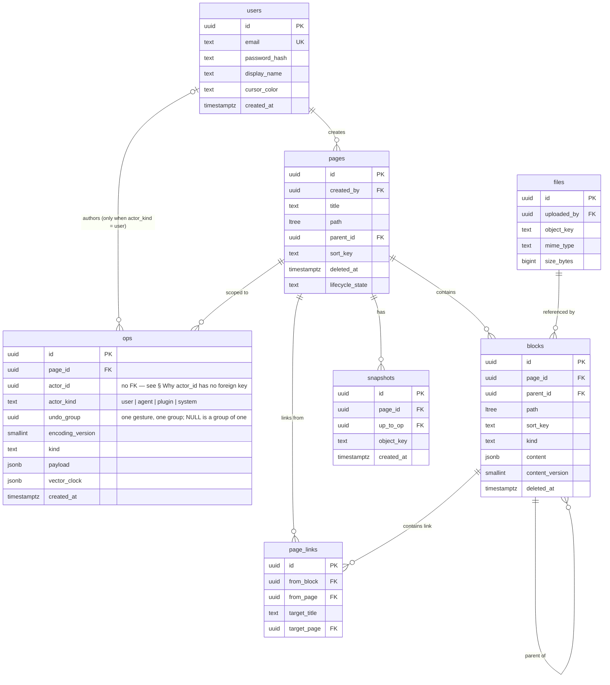

# Marginal — Data Model

**Database:** PostgreSQL 18 · **Access:** sqlx with compile-time checked queries (ADR-003)

**One database per service** (ADR-003) — realised in the resident deployment as **one instance with a schema and role per service** (ADR-010 §3). No cross-schema joins — data needed elsewhere travels as events and is materialised locally, or is composed at the gateway. See §1.

---

## 1. The Central Rule

> **The op log is the source of truth. Block rows are a projection.**

```
   collab.ops  ──replay──▶  docs.blocks
   (append-only,            (materialised current state,
    never UPDATE,            rebuildable from ops,
    never DELETE)            exists for query performance)

   owned by                 owned by
   collaboration-service    document-service
```

A test must prove the projection can be rebuilt by replay. Snapshots exist for performance, never for correctness.

### Who owns which schema, and the one exception

**Database per service — one PostgreSQL instance each**, not schemas in a shared one
(**ADR-003**). Isolation is enforced by the network, so one service's database failing
degrades only that service.

> The schema names below (`auth`, `docs`, `collab`, `history`) remain as *namespaces within* each
> service's own database. They are no longer schemas sharing one instance by default.

**Four schemas exist, and most services do not have one.** "Database per service" makes it sound
as though every service gets storage; here only four of eleven are Postgres-backed, and the
interesting ones deliberately are not — Postgres is the wrong tool for a rope or an inverted index.

| Service | Postgres schema | Its other durable state |
|---|---|---|
| `auth-service` | **`auth`** | Redis — the `jti` revocation blocklist |
| `document-service` | **`docs`** | — |
| `history-service` | **`history`** | Object storage — Parquet snapshots (§5) |
| `collaboration-service` | **`collab`** — `ops` and its own outbox | **The local WAL on the filesystem**; Redis for presence, lease, and the instance registry; the rope in memory |
| `search-service` | none | A Tantivy index on a local volume |
| `diagnostics-service` | none | In-memory, materialised from NATS. *Whether the reverse index earns a schema is an open question — RFC-003 §Open questions* |
| `api-gateway` | none | Stateless. Redis for rate limits |

**What makes it real rather than cosmetic:**

- **No cross-schema joins.** `docs` never joins `auth`, `collab` or `history`. Data needed elsewhere travels as events and is materialised locally
- **No cross-schema foreign keys.** `docs.pages.created_by` references a user by plain `UUID` with no constraint, validated at the application layer (§4). Same reasoning as § *Why `actor_id` has no foreign key*
- Each schema migrates independently, on its own service's cadence

**Local development runs one Postgres container per service too.** It costs RAM and nothing else,
and a local topology that does not match the deployed one hides exactly the failure isolation this
design exists to provide (`CLOUD_PORTABILITY.md` §1).

### The isolation must be a grant, not a convention

> **ADR-010 — in the deployed estate, the grant is the *primary* mechanism, not defence in depth.**
> Eleven Postgres instances do not fit the cost ceiling, so the resident deployment is **one
> serverless Postgres with a schema and a login role per service**. Everything below is unchanged
> except which layer enforces it: there is no network boundary between schemas, so the grant *is*
> the boundary. Local development and Tier S sessions still run an instance per service, and a
> service that respects its grant is extractable to its own instance by changing a connection
> string.

With one instance per service the network enforces the boundary, so this would be **defence in
depth** rather than the primary mechanism. It still earns its place either way: it scopes what a
compromised service can reach *inside its own database*, and it makes the ownership exception below
visible as a grant rather than a paragraph.

**One Postgres role per service, granted only on its own schema:**

```sql
CREATE ROLE docs_svc LOGIN PASSWORD :'from_secret_manager';
GRANT USAGE ON SCHEMA docs TO docs_svc;
GRANT SELECT, INSERT, UPDATE ON ALL TABLES IN SCHEMA docs TO docs_svc;
-- and no grant whatsoever on auth or history
```

| What it buys | |
|---|---|
| **Enforcement** | A cross-schema join fails at the database instead of passing review |
| **Blast radius** | A compromised `document-service` cannot read `auth.users.password_hash` |
| **Ownership becomes visible** | `collab_svc` is granted on `collab` **and on nothing in `docs`** — the op log is its own, and `document-service` materialises `blocks` from published events rather than from a shared table. Drift shows up as a permission error |

**Migrate as the owner, run as the restricted role.** DDL rights and runtime rights are different
concerns; conflating them means a service can drop its own tables. Two roles per schema — an owner
used only by `sqlx migrate`, and a login role used by the running service.

**When:** this is pointless today with one service and one schema. It starts mattering the moment
**Phase 2** puts password hashes into the same instance, which is the natural place to do it.

### Where a "join" happens now that there is no shared database

With one database per service, `JOIN` across services is not a thing you decide against — it is not
expressible. Assembly moves to one of three places, and **the choice is per data shape, not global.**

| Pattern | Use it for | Example here |
|---|---|---|
| **Local materialisation from events** | Small, slowly changing reference data needed on a **hot path** | `display_name` and `cursor_color`. Every page load and every presence update needs them; each service keeps a tiny `users` projection fed by `auth.user_updated` |
| **Synchronous gRPC** | One-off lookups **off** the hot path | `AuthService.GetUser` for an admin screen |
| **API composition at the gateway** | The *client* needs one response spanning services | A page view that carries page metadata, backlinks, and comment counts |

> **The hot-path rule is the one that matters.** Resolving a display name over gRPC on every page
> load would put `auth-service`'s availability back on the read path — undoing precisely the
> isolation that made JWT-verified-locally-at-the-gateway worth doing. **If it is needed on every
> read, materialise it; do not call for it.**

This resolves a contradiction that existed between §1 above (*"travels as NATS events and is
materialised locally"*) and `lld/auth-service.md` §4, where `GetUser` was described as the way other
services resolve a display name. Both are correct — for different call sites — and the table above
is the rule for choosing.

**API composition is the gateway's job and nothing else's.** A service must not call two other
services to build a response; that is a distributed join with a service's name on it, and it turns
one slow dependency into a slow dependency for everybody (`ROADMAP.md` § Tail latency amplification).

### Ownership transfers for the life of a session

**No service writes another's tables.** `collaboration-service` owns `collab.ops` and its own
outbox; `document-service` owns `docs.pages`, `docs.blocks` and `docs.page_links`, materialising
`blocks` by replaying the op events the first publishes.

That leaves one question the schema alone cannot answer: **while a session is live, who is
authoritative for a page's content?**

**The rule: ownership of a page's block data transfers for the life of a session.** RFC-001 §2 already says it — *while a session is live the rope is authoritative; the
JSONB is a checkpoint, not the truth.* So `collaboration-service` is not a competing writer; it is
the **current owner**, flushing a checkpoint of state it holds authoritatively, and
`document-service` is the owner at every other time.

The alternatives were worse:

| Alternative | Why not |
|---|---|
| Flush through `document-service` over gRPC | Doubles write latency on the hot path and forces an API shaped like *"here is a rope projection"*, which is not a document operation |
| Keep both services writing `docs.blocks` | What was done first, and what ADR-003 reversed. Two writers on one table is exactly what database-per-service forbids, and the "ownership transfers for the life of a session" rule was the justification it needed. The rule survives — it still decides who is authoritative — but it no longer has to excuse a shared table |

**What was chosen instead:** `collaboration-service` gets `collab`, owns `ops` and its own outbox,
and publishes op events. `document-service` materialises `docs.blocks` by replaying them. The cost
is that `docs.blocks` lags the live rope during a session, which `ARCHITECTURE.md` § The couplings
records as the one remaining coupling and calls deliberate — read-your-writes reads from the
doc-actor.

**Two consequences that follow, and both are binding:**

1. **Each table has exactly one writer**, so a migration is one service's problem. `collab.ops` is `collaboration-service`'s; `docs.blocks` is `document-service`'s. What still crosses the line is the **event contract** between them (§10), and that is what must be rolled out consumers-before-producers (`ROADMAP.md` Phase 11)
2. **The transfer must be explicit, not implied.** It is the lease in `collaboration-service`'s `ownership/` module — a page has one owner at a time, enforced by a fencing token, and that lease is what decides who is authoritative for a page's content while a session is live

---

## 2. Entity Relationships

> **This diagram spans three databases.** Relationships crossing a service boundary —
> `users → pages`, `users → ops`, `pages → ops`, `ops → snapshots` — are **application-level
> references, not foreign keys**, and cannot be enforced or joined (ADR-003). Only
> edges within one service's database are real constraints.



---

## 3. `auth` Schema

```sql
CREATE SCHEMA auth;

CREATE TABLE auth.users (
    id             UUID PRIMARY KEY DEFAULT uuidv7(),
    email          TEXT NOT NULL UNIQUE,
    -- Argon2id PHC string. Never a raw hash, never a separate salt column:
    -- the PHC format carries algorithm, parameters, and salt together, so
    -- parameters can be upgraded without a schema migration.
    password_hash  TEXT NOT NULL,
    display_name   TEXT NOT NULL,
    -- Assigned at signup so collaborators are visually distinguishable.
    cursor_color   TEXT NOT NULL,
    created_at     TIMESTAMPTZ NOT NULL DEFAULT NOW()
);

CREATE TABLE auth.refresh_tokens (
    id          UUID PRIMARY KEY DEFAULT uuidv7(),
    user_id     UUID NOT NULL REFERENCES auth.users(id) ON DELETE CASCADE,
    -- SHA-256 of the token, never the token itself: a database leak must not
    -- yield usable credentials.
    token_hash  BYTEA NOT NULL UNIQUE,
    -- Rotation chain. On refresh the old row is revoked and a new one issued
    -- with parent_id set. Reuse of a revoked token means theft — revoke the
    -- entire chain.
    parent_id   UUID REFERENCES auth.refresh_tokens(id),
    expires_at  TIMESTAMPTZ NOT NULL,
    revoked_at  TIMESTAMPTZ,
    created_at  TIMESTAMPTZ NOT NULL DEFAULT NOW()
);
CREATE INDEX ON auth.refresh_tokens (user_id) WHERE revoked_at IS NULL;
```

### Spaces and memberships (`v3.1.0`, `ADR-013`)

```sql
-- The permission boundary. A page belongs to exactly one space, and its
-- permissions ARE its space's — which is what makes a check one lookup
-- instead of a walk up the page tree, and what stops "who can read this"
-- from depending on where somebody last dragged it.
CREATE TABLE auth.spaces (
    id          UUID PRIMARY KEY DEFAULT uuidv7(),
    name        TEXT NOT NULL,
    -- The space every pre-v3.1.0 page was migrated into. Exactly one row may
    -- carry this, and it cannot be deleted: it is what "the workspace" meant
    -- before spaces existed, and a delete would orphan every page written
    -- before the migration.
    is_default  BOOLEAN NOT NULL DEFAULT FALSE,
    created_by  UUID NOT NULL REFERENCES auth.users(id),
    created_at  TIMESTAMPTZ NOT NULL DEFAULT NOW()
);
CREATE UNIQUE INDEX ON auth.spaces (is_default) WHERE is_default;

-- One row per (user, space). The role is on the MEMBERSHIP, not on the user:
-- a person is an admin of one space and a viewer of another, and a role
-- stored on auth.users could not say that.
CREATE TABLE auth.memberships (
    user_id     UUID NOT NULL REFERENCES auth.users(id) ON DELETE CASCADE,
    space_id    UUID NOT NULL REFERENCES auth.spaces(id) ON DELETE CASCADE,
    -- Three, deliberately. viewer reads; editor also emits ops; admin also
    -- manages membership and deletes the space. A fourth role is a product
    -- decision this repo has no requirement for — adding one later is a row
    -- and a switch arm; adding one now is a guess (ADR-013 §2).
    role        TEXT NOT NULL CHECK (role IN ('viewer','editor','admin')),
    granted_by  UUID REFERENCES auth.users(id),
    created_at  TIMESTAMPTZ NOT NULL DEFAULT NOW(),
    PRIMARY KEY (user_id, space_id)
);
CREATE INDEX ON auth.memberships (space_id);
```

**A space cannot be left without an admin.** Enforced in the service, not by
a constraint: the rule is "the last admin of a space may not be demoted or
removed", which is a statement about the *set* of remaining rows and cannot
be expressed as a row-level `CHECK`. A trigger could, but a trigger that
rejects a legitimate two-step change (promote B, then demote A) is worse
than the check living where the transaction does.

Access tokens are **not** stored — they are RS256-signed JWTs verified locally by the gateway (ADR-007). Revocation is a Redis blocklist keyed by `jti` with a TTL matching token lifetime.

---

## 4. `docs` Schema

### Pages

```sql
CREATE SCHEMA docs;
CREATE EXTENSION IF NOT EXISTS ltree;

CREATE TABLE docs.pages (
    id           UUID PRIMARY KEY DEFAULT uuidv7(),
    created_by   UUID NOT NULL,           -- auth.users(id), no FK: cross-schema
    title        TEXT NOT NULL,
    parent_id    UUID REFERENCES docs.pages(id),
    -- Materialised ancestry, e.g. 'root.a1b2.c3d4'. Subtree queries via <@
    -- without a recursive CTE on the hot path.
    path         LTREE NOT NULL,
    -- Fractional index: a page is reordered by writing ONE row, never by
    -- renumbering siblings. Lexicographic ordering, midpoint generation.
    sort_key     TEXT NOT NULL,
    -- The permission boundary (ADR-013 §2). NOT NULL: a page with no space
    -- is a page no rule applies to, which is the one state this must never
    -- be able to reach. No FK — auth.spaces lives in another service's
    -- schema, and this repo does not join across them (§1); document-service
    -- keeps a local projection of which spaces exist, fed by auth's events.
    space_id     UUID NOT NULL,
    -- Saga state (ARCHITECTURE §5). A crash mid-delete resumes, not restarts.
    lifecycle_state TEXT NOT NULL DEFAULT 'active'
        CHECK (lifecycle_state IN ('active','deleting','deleted')),
    deleted_at   TIMESTAMPTZ,
    created_at   TIMESTAMPTZ NOT NULL DEFAULT NOW(),
    updated_at   TIMESTAMPTZ NOT NULL DEFAULT NOW()
);
CREATE INDEX ON docs.pages USING GIST (path);
CREATE INDEX ON docs.pages (parent_id, sort_key) WHERE deleted_at IS NULL;
-- Every read filters by "the spaces you are in" before anything else, so
-- this index is on the hot path of listing, searching and the graph.
CREATE INDEX ON docs.pages (space_id) WHERE deleted_at IS NULL;
-- Title uniqueness is NOT enforced: duplicates are a diagnostic
-- (RFC-003 DuplicateTitle), not a constraint violation. Enforcing it here
-- would make a legitimate in-progress edit fail at the database.
CREATE INDEX ON docs.pages (lower(title)) WHERE deleted_at IS NULL;
```

`search_vector` (migration `00004_search_vectors.sql`, `v2.5.0`) is
`GENERATED ALWAYS AS (to_tsvector('english', title)) STORED`, GIN-indexed
— full-text search against the title, transactionally consistent with
it (`docs/api/search.md` §1). Not shown above alongside the original
columns since it postdates them by three migrations; see that file for
the exact `ALTER TABLE`.

### Reading positions — resume, and where view state lives

The dashboard's "resume" is not a recent-files list. A recent-files list is
derivable from `updated_at` and says only *that* a page changed; resume says
**where you were in it**, which nothing in the tree records.

That position is **view state**, and RFC-001 §1's rule about view state —
toggle collapse never enters the block tree — applies here for a sharper
reason: if the caret were model state, moving your cursor would be a
collaborative edit that moved everyone else's. So it is stored per user,
beside the document rather than in it (`v2.8.0`, migration
`00007_reading_positions.sql`):

```sql
CREATE TABLE docs.reading_positions (
    user_id    UUID NOT NULL,          -- auth.users(id), no FK: cross-schema
    page_id    UUID NOT NULL REFERENCES docs.pages(id) ON DELETE CASCADE,
    -- Where the caret was. block_id rather than an offset into the page:
    -- an offset is invalidated by any concurrent edit before it, which is
    -- the same argument RFC-002 §2 makes for anchors over offsets, applied
    -- one level up.
    block_id   UUID,
    -- Offsets WITHIN that block. Tolerable here where a page-level offset
    -- would not be: a block is small, a stale offset lands a few characters
    -- off, and resume is advisory — it is not an op and nothing replays it.
    caret_start INT NOT NULL DEFAULT 0,
    caret_end   INT NOT NULL DEFAULT 0,
    updated_at TIMESTAMPTZ NOT NULL DEFAULT NOW(),
    PRIMARY KEY (user_id, page_id)
);
-- "Where was I?" — one user's most recent positions, newest first.
CREATE INDEX ON docs.reading_positions (user_id, updated_at DESC);
```

**Why document-service owns it.** A reading position is *about a page*, and
`document-service` owns pages — the `ON DELETE CASCADE` above is the whole
argument: a position in a page that no longer exists is not a position. Put
it in `auth-service` and that cascade becomes a cross-service saga to delete
a row nobody would miss.

**One row per (user, page), overwritten.** History of where you have been is
a different feature with a different retention story; this answers exactly
one question and is upserted rather than appended, so it cannot grow without
bound.

### Page deletions — the saga's own state

`lifecycle_state` above says *what* a page is; it cannot say *how far a
delete got*. Resumability needs per-step progress, and progress belongs
to the **operation**, not the page: it has its own lifetime, its own
retry count, and it outlives nothing — once the page is purged the row
is history, not state. So it is its own table (`v2.6.0`, migration
`00005_page_deletions.sql`):

```sql
CREATE TABLE docs.page_deletions (
    page_id      UUID PRIMARY KEY REFERENCES docs.pages(id) ON DELETE CASCADE,
    requested_by UUID NOT NULL,          -- auth.users(id), no FK: cross-schema
    -- Steps completed so far, in order. A step appends its own name here
    -- exactly once; the sweeper resumes at the first name NOT present.
    -- An array rather than a column per step: adding a step (embeddings,
    -- blobs — v4) must not be a migration on a hot table, and the set of
    -- steps is a property of the code's version, not the schema's.
    steps_done   TEXT[] NOT NULL DEFAULT '{}',
    -- Bumped on every resume, so "resumed once" is a fact rather than an
    -- inference from timestamps (ui-mockups § 23c TRASH & RESTORE).
    attempts     INT NOT NULL DEFAULT 1,
    -- Set when the last step lands. Until then the page is 'deleting' and
    -- the sweeper owns it; after, it is 'deleted' and restorable.
    completed_at TIMESTAMPTZ,
    -- Forward-only compensation (ARCHITECTURE §5): a step that keeps
    -- failing is retried, never rolled back. This records the last reason
    -- so a stuck saga is diagnosable rather than merely slow.
    last_error   TEXT,
    started_at   TIMESTAMPTZ NOT NULL DEFAULT NOW(),
    updated_at   TIMESTAMPTZ NOT NULL DEFAULT NOW()
);
-- The sweeper's claim query — every in-flight saga, oldest first.
CREATE INDEX ON docs.page_deletions (started_at) WHERE completed_at IS NULL;
```

**Why not columns on `docs.pages`.** A page is read on every tree
render; a saga row is read by one background sweeper. Putting five
step-flags on the hot table widens every one of those reads to carry
state almost every row has no use for, and makes adding a sixth step a
migration on the table the editor blocks on.

**The purge window is derived, not stored.** "Restorable until purge" is
`deleted_at + interval`, computed at read time. A stored `purge_at`
would be a second copy of a value that only ever changes when policy
does — and changing policy should move every pending purge, which a
derived value does for free and a stored one needs a backfill for.

### Blocks

`document-service`'s actual `docs.blocks` (`internal/migrate/migrations/00002_docs_blocks_and_links.sql`) is a fully-rebuilt-on-every-event projection (§ The Central Rule) — it uses `pgx/v5` + `sqlc`, not `sqlx` (the Go/TS pivot, `ADR-011`, superseded the earlier Rust-track tooling this doc originally assumed), a plain `INTEGER position` rather than a fractional `sort_key` (a projection has no concurrent-independent-writer reordering problem a fractional key exists to solve — `internal/blockproj`'s own doc comment), and no `deleted_at`/`content_version` (a block's whole row is replaced, not soft-deleted, on the next replay). `parent_id` and `path` below are new — RFC-001 §1's containment design (`Quote`/`Toggle`/`List`/`ListItem` nesting), materialised the same way `docs.pages` already materialises pages-within-pages:

```sql
CREATE TABLE docs.blocks (
    id         UUID PRIMARY KEY,          -- same id collaboration-service's ops name — the projection's join key to its source
    page_id    UUID NOT NULL REFERENCES docs.pages(id) ON DELETE CASCADE,
    parent_id  UUID REFERENCES docs.blocks(id) ON DELETE CASCADE,
    -- Materialised ancestry, e.g. 'p<block-hex>.p<block-hex>' — same LTREE
    -- shape docs.pages.path already uses, one level deeper. documentcore's
    -- own in-memory Page does NOT carry this — a block only needs to know
    -- its immediate Parent there; path exists purely so this table can
    -- answer "every descendant of X" as an indexed <@ query, the same
    -- reason docs.pages has one (RFC-001 §1 "Persisted form is not the
    -- in-memory form").
    path       LTREE NOT NULL,
    position   INTEGER NOT NULL,          -- depth-first order within the page — a parent immediately precedes all its descendants, then the next top-level sibling
    kind       JSONB NOT NULL,            -- documentcore.BlockKind's own tagged-object JSON shape
    content    JSONB NOT NULL DEFAULT '{}', -- documentcore.Content{text, marks}
    updated_at TIMESTAMPTZ NOT NULL DEFAULT NOW()
);
CREATE INDEX ON docs.blocks USING GIST (path);
CREATE INDEX ON docs.blocks (page_id, position);
```

`search_vector` (migration `00004_search_vectors.sql`, `v2.5.0`) is
`GENERATED ALWAYS AS (to_tsvector('english', coalesce(content->>'text', ''))) STORED`,
GIN-indexed — full-text search against a block's own live text
(`docs/api/search.md` §1), same reasoning as `docs.pages.search_vector`
above.

### `kind` shape per `BlockTag`

Matches `documentcore.BlockKind`'s own `MarshalJSON` exactly (`block.go`) — the tag names an unused field, never sends it:

```json
// paragraph | quote | toggle | divider
{"tag": "paragraph"}

// heading — Level meaningful only here
{"tag": "heading", "level": 2}

// code_block — Language meaningful only here
{"tag": "code_block", "language": "go"}

// list — ListKind meaningful only here
{"tag": "list", "list_kind": "todo"}

// list_item — Checked meaningful only when the parent list's ListKind is "todo"
{"tag": "list_item", "checked": false}

// image — FileId meaningful only here; no upload/asset pipeline backs it yet (RFC-001 §1)
{"tag": "image", "file_id": "uuid"}
```

### `content` shape

One shape for every `BlockTag` — `documentcore.Content{text, marks}` (RFC-001 §2), whether the block is a leaf's own text (`Paragraph`/`Heading`/`Code`), a container's own inline text (`Quote`/`Toggle`/`ListItem`'s `Spans`), or an `Image`'s `Caption`:

```json
{"text": "Hello world", "marks": [{"kind": {"tag": "bold"}, "start": 0, "end": 5}]}
```

`Code` never carries marks in practice (RFC-001 §1: "code is never bold") but the shape is the same — `documentcore` doesn't special-case it structurally, only `CodeBlock`'s own editing surface never offers formatting.

### The op log — `document-service` in Phase 1, `collaboration-service` from Phase 3

> **Ownership moves once** (ADR-003). Phase 1 ships a single-user editor that saves, so
> `document-service` writes **block-granular ops** (RFC-002 §2.1) and applies them to `blocks`
> itself. At Phase 3 the table moves to `collaboration-service`, character-granular ops arrive with
> the rope, and `document-service` switches to materialising `blocks` from op events.
>
> Either way §1's central rule holds: `ops` is the source of truth, `blocks` is the projection.

```sql
-- APPEND ONLY. No UPDATE. No DELETE. This is the source of truth.
CREATE TABLE collab.ops (
    id               UUID PRIMARY KEY,      -- UUIDv7 from the client; the dedup key
    -- NO foreign key: `pages` is document-service's, this table is
    -- collaboration-service's. Cross-schema references are plain UUID,
    -- validated at the application layer (ADR-003).
    page_id          UUID NOT NULL,

    -- NO foreign key, deliberately. Once the assistant and plugins are actors
    -- (ADR-009), not every actor has a row in auth.users. See § Why actor_id
    -- has no foreign key — do not "fix" this in review.
    actor_id         UUID NOT NULL,
    actor_kind       TEXT NOT NULL DEFAULT 'user'
                     CHECK (actor_kind IN ('user','agent','plugin','system')),

    -- One user gesture, one group. NULL means a group of one.
    undo_group       UUID,

    -- Encoding version, present from op #1. History replay must decode ops
    -- written by every prior release, forever (RFC-002 §4).
    encoding_version SMALLINT NOT NULL,
    kind             TEXT NOT NULL,         -- 'insert_text', 'delete_block', …
    payload          JSONB NOT NULL,        -- carries inverse data: deleted text, subtree
    vector_clock     JSONB NOT NULL,
    created_at       TIMESTAMPTZ NOT NULL DEFAULT NOW()
);
CREATE INDEX ON collab.ops (page_id, created_at);
CREATE INDEX ON collab.ops (page_id, actor_id, created_at);  -- per-user undo
```

`payload` carries inversion data — deleted text, the removed subtree, `from` values. Deletes are the large ops precisely because they must be invertible (RFC-002 §3).

### Two columns that must exist from op #1

The op log is **append-only and never rewritten**. Anything a later phase needs from an op
record either exists now or is added with a default that is *true of every historical row*.
Both of these clear that bar, which is the only reason they are cheap:

| Column | Needed by | Why not later |
|---|---|---|
| `actor_kind` | `can_apply` authorizing a plugin differently from a person (18); history rendering three actor colours, which `ui-mockups/v2/index.html § 17 HISTORY` already does | Backfilling `'user'` is *correct* — every op written before the assistant existed was a user op. Add it after and the default is a guess instead of a fact |
| `undo_group` | Per-actor undo (5). One paste is many ops; one `## ` keystroke is `SetBlockKind` + `DeleteText`; accepting one assistant proposal is N ops | NULL degrades to a group of one, so this is genuinely addable later — it is here because it costs nothing now and saves a migration on a table you cannot rewrite |

> **Undo pops the newest *group* belonging to this actor, not the newest op.** Without that
> rule ⌘Z undoes one twentieth of a paste and the user sees garbage. The group is assigned by
> whoever originates the gesture — the client for paste and input rules, the assistant for a
> proposal batch — never by the server, which cannot know where a gesture began.

`actor_kind` is `TEXT` with a `CHECK`, not a Postgres `ENUM`: extending a check constraint is
ordinary DDL, while extending an enum is a special case with its own transaction rules. The
neighbouring `kind` column already sets that precedent.

### Why `actor_id` has no foreign key

`docs.users` lives in the auth schema and holds people. `agent`, `plugin`, and `system` actors
have no row there and never will. A foreign key would either block those ops or force fake user
rows for a language model and a WASM module — so the constraint is **absent on purpose**, and
`actor_kind` is what makes the reference interpretable.

### Outbox — one per publishing service

> **Two of these exist**, one in each publishing service's own database — `document-service` for
> page lifecycle events, `collaboration-service` for op events. That is what database-per-service
> requires, and it removes the coupling where one service being down silenced the bus for everyone
> (`ARCHITECTURE.md` §1).

```sql
-- Postgres write + NATS publish is a dual write: two systems, no distributed
-- transaction. If COMMIT succeeds and publish fails, the event is lost
-- permanently — search never indexes it, history has a hole, nothing notices.
-- The event row is written in the SAME transaction; a poller publishes it.
CREATE TABLE <schema>.outbox (   -- one per publishing service: docs, collab
    id            UUID PRIMARY KEY DEFAULT uuidv7(),
    aggregate_id  UUID NOT NULL,
    event_type    TEXT NOT NULL,
    payload       JSONB NOT NULL DEFAULT '{}',
    published_at  TIMESTAMPTZ,
    created_at    TIMESTAMPTZ NOT NULL DEFAULT NOW()
);
-- Partial index: the poller only scans unpublished rows, so it stays small
-- however large the table grows. Claim with FOR UPDATE SKIP LOCKED.
CREATE INDEX ON <schema>.outbox (created_at) WHERE published_at IS NULL;
```

At-least-once, not exactly-once. A crash between publish and stamp republishes — correct and unavoidable, so **every consumer must be idempotent**.

### Page links

```sql
-- Forward and reverse index for [[Page Link]] resolution. Serves BOTH
-- diagnostic invalidation and the backlinks panel (RFC-003 §3).
CREATE TABLE docs.page_links (
    id            UUID PRIMARY KEY DEFAULT uuidv7(),
    from_page     UUID NOT NULL REFERENCES docs.pages(id) ON DELETE CASCADE,
    from_block    UUID NOT NULL REFERENCES docs.blocks(id) ON DELETE CASCADE,
    -- The literal text written. Retained even when resolution succeeds, so a
    -- rename can re-resolve, and a dangling link survives as a diagnostic.
    target_title  TEXT NOT NULL,
    target_page   UUID REFERENCES docs.pages(id),   -- NULL = dangling
    UNIQUE (from_block, target_title)
);
CREATE INDEX ON docs.page_links (lower(target_title));   -- reverse lookup on rename
CREATE INDEX ON docs.page_links (target_page) WHERE target_page IS NOT NULL;
```

### Files

```sql
CREATE TABLE docs.files (
    id          UUID PRIMARY KEY DEFAULT uuidv7(),
    uploaded_by UUID NOT NULL,
    object_key  TEXT NOT NULL UNIQUE,
    mime_type   TEXT NOT NULL,
    size_bytes  BIGINT NOT NULL,
    created_at  TIMESTAMPTZ NOT NULL DEFAULT NOW()
);
```

Bytes go browser → S3/MinIO directly via presigned PUT, bypassing every service. Only metadata is stored here.

---

## 5. `history` Schema

```sql
CREATE SCHEMA history;

-- CQRS read model, projected from collab.ops. Snapshot bodies live in object
-- storage; only pointers are relational.
CREATE TABLE history.snapshots (
    id          UUID PRIMARY KEY DEFAULT uuidv7(),
    page_id     UUID NOT NULL,
    -- Replay from this op forward to reconstruct any later state.
    -- Cross-database: `ops` lives in collaboration-service. Plain UUID, no FK.
    up_to_op    UUID NOT NULL,
    object_key  TEXT NOT NULL,
    op_count    INTEGER NOT NULL,
    created_at  TIMESTAMPTZ NOT NULL DEFAULT NOW()
);
CREATE INDEX ON history.snapshots (page_id, created_at DESC);

-- Edit bursts grouped into user-meaningful entries, so the scrubber shows
-- sessions rather than keystrokes.
CREATE TABLE history.sessions (
    id          UUID PRIMARY KEY DEFAULT uuidv7(),
    page_id     UUID NOT NULL,
    actor_ids   UUID[] NOT NULL,
    first_op    UUID NOT NULL,
    last_op     UUID NOT NULL,
    started_at  TIMESTAMPTZ NOT NULL,
    ended_at    TIMESTAMPTZ NOT NULL
);
CREATE INDEX ON history.sessions (page_id, started_at DESC);
```

---

### Snapshot format — Parquet

`object_key` points at a **Parquet** file, not a blob of serialised ops. Columnar, compressed,
self-describing, and — the reason it wins — **queryable in place**: a cold snapshot in object
storage can be read directly by Polars or DuckDB without restoring anything first.

The alternative was an opaque `rkyv` or `bincode` dump, which is faster to write and useless
to anyone who is not this exact binary. Snapshots are the one artifact that outlives the
release that wrote them, so a self-describing format earns its cost.

---

## 6. Redis Keys

| Key | Type | TTL | Purpose |
|---|---|---|---|
| `jwt:blocklist:{jti}` | string | token lifetime | Revocation without a per-request RPC |
| `presence:{page_id}` | hash | 30s refresh | Who is on the page, cursor colour |
| `ratelimit:{actor}:{route}` | string | window | Token bucket at the gateway |
| `collab:instances` | hash | 10s heartbeat | Instance registry for consistent-hash routing |
| `collab:page:{page_id}` | string | session | Which instance owns this page |
| `snapshot:lock:{page_id}` | string | 60s | Distributed lock + fencing token for the snapshot worker |
| `dedup:op:{op_id}` | string | 1h | Idempotent consumer guard |

---

## 7. Type Mapping

```
PostgreSQL              Rust (crates/domain)
──────────              ──────────────────
UUID                ↔   PageId, BlockId, OpId, UserId, FileId  (newtypes)
TEXT                ↔   String / &str
TEXT (kind)         ↔   BlockKind        (serde rename_all = "snake_case")
JSONB               ↔   BlockContent     (tagged enum, versioned)
LTREE               ↔   MaterialisedPath (newtype, validated)
TEXT (sort_key)     ↔   SortKey          (fractional index newtype)
JSONB               ↔   VectorClock
TIMESTAMPTZ         ↔   OffsetDateTime   (time crate)
```

Every id is a distinct newtype over `Uuid` — the compiler rejects passing a `BlockId` where a `PageId` belongs. Cross-schema references are plain `UUID` with no FK, validated at the application layer.

---

## 8. Invariants Not Expressible as Constraints

Enforced in Rust and covered by `proptest`:

| Invariant | Why not a constraint |
|---|---|
| Sibling `sort_key`s are strictly ordered and distinct | Fractional index generation is application logic |
| `blocks.path` matches the `parent_id` chain | LTREE cannot self-reference for validation |
| `content` shape matches `kind` | JSONB is unvalidated by design; enforced by the tagged enum plus `content_version` |
| Adjacent spans have distinct mark sets | Normalisation invariant (RFC-001 §2) |
| Replaying `ops` reproduces `blocks` | The projection property — a test, not a constraint |
| `collab.ops` is never truncated | See §9 — a decision, not an omission |
| No cycles in `parent_id` | Would need a recursive check on every write |

---

## 9. The Log Is Never Truncated

`collab.ops` grows forever. That is a decision, not an omission, and it is recorded because the
absence of a compaction mechanism reads like a gap otherwise.

**Snapshots are performance, never origin.** A snapshot lets replay start late; it does not
become the new beginning of history. Truncating behind one would break the invariant that
replaying `ops` reproduces `blocks`, and it would put a discontinuity in the middle of three
readers that walk the log: per-actor undo, history scrubbing, and Merkle reconciliation.

The growth is bounded by human typing. Batched ~20:1 (RFC-002 §7), one active editor produces a
few megabytes a year. **Phase 12 gets a measurement, not a mechanism** — a dashboard row for
op-log size and growth rate. If the number ever justifies compaction, that is an ADR with real
data behind it rather than a precaution built on a guess.

### The assistant must not stream into the log

A model streams tokens; ops are discrete. One `InsertText` per token would flood the log and
make undo useless. The assistant's output is **buffered client-side and emitted as one op batch
sharing one `undo_group`** when the proposal is accepted. This is not only a volume argument —
it is what makes a proposal reviewable before it lands, which ADR-009 §7 requires anyway.

---

## 10. Event Topics and Subscriptions

The bus inventory, in one place. `ARCHITECTURE.md` §2 draws the graph; this is the table the
Terraform `pubsub` module and the `NatsBus` stream config are both generated from, so a topic
that is not here does not exist.

**One topic per event type, not one per service.** A subscriber that wants two event types takes
two subscriptions rather than filtering a firehose — the cost is a Terraform block and the gain
is that redelivery and dead-lettering are scoped to the thing that actually failed.

### Topics

| Topic | Publisher | Ordering key | Consumed by |
|---|---|---|---|
| `docs.page_created` | `document-service` | `page_id` | search · diagnostics · history |
| `docs.page_renamed` | `document-service` | `page_id` | search · **diagnostics** · publishing |
| `docs.page_deleted` | `document-service` | `page_id` | **collaboration-service** · search · diagnostics · history · notification |
| `collab.page_released` | `collaboration-service` | `page_id` | **document-service** |
| `docs.block_updated` | `document-service` | `page_id` | search · diagnostics |
| `docs.block_deleted` | `document-service` | `page_id` | search · diagnostics |
| `docs.page_shared` | `document-service` | `page_id` | notification |
| `docs.page_published` | `document-service` | `page_id` | publishing · search |
| `collab.ops_flushed` | `collaboration-service` | `page_id` | **document-service** · history · search · diagnostics · analytics |
| `auth.user_registered` | `auth-service` | `user_id` | notification |
| `collab.comment_mentioned` | `collaboration-service` | `page_id` | **notification** (`v3.3.0`) |
| `auth.user_updated` | `auth-service` | `user_id` | every service holding a `users` projection (§1) |
| `auth.user_deactivated` | `auth-service` | `user_id` | document · notification · search |
| `auth.role_granted` | `auth-service` | `user_id` | document (local permission read-model) |
| `auth.role_revoked` | `auth-service` | `user_id` | document · search (refilter results) |

### `docs.space_members` — the local permission read-model (`v3.1.0`)

`document-service` filters every read by "the spaces you are in", and it
cannot ask `auth-service` that question per request: it is on the hot path of
listing, searching and the graph, and a join across service schemas is the
thing §1 exists to forbid.

So it keeps a projection, fed by `auth.role_granted` / `auth.role_revoked`:

```sql
-- A PROJECTION of auth.memberships, never a second source of truth. If it
-- disagrees with auth, auth is right and this is stale — which is why the
-- write path (can_apply, in collaboration-service) does NOT read it. This
-- table decides what you can SEE; auth decides what you can DO.
CREATE TABLE docs.space_members (
    user_id     UUID NOT NULL,
    space_id    UUID NOT NULL,
    role        TEXT NOT NULL,
    -- The event's own timestamp, not NOW(). Two events for one user can
    -- arrive out of order (core NATS gives no ordering guarantee across
    -- publishes), and last-write-wins by arrival would let a revoke be
    -- undone by a grant that happened before it.
    granted_at  TIMESTAMPTZ NOT NULL,
    PRIMARY KEY (user_id, space_id)
);
CREATE INDEX ON docs.space_members (user_id);
```

**The staleness is real and bounded, not hidden.** Core NATS has no
redelivery (`internal/notify`'s doc comment), so a dropped `role_revoked`
leaves someone able to *read* a space they were removed from until the next
event for that user arrives. Two things keep that honest:

1. It is a **read** model only. Writing is gated by `can_apply`, which
   resolves the role from `auth-service` at join (`ADR-013` §3) rather than
   from this table.
2. `document-service` reconciles on startup and on a timer by asking
   `auth-service` for the full membership set — the same "periodically ask
   the source of truth" answer the `authverify` JWKS cache already uses, for
   the same reason: an event bus with no redelivery needs a floor under how
   wrong it can get.

### Comments (`v3.2.0`) — `collab`, and NOT ops

**Owned by `collaboration-service`, in the `collab` schema.** A comment's
extent is an `AnchorRange` — the same stable range a mark uses (RFC-001 §9)
— and an anchor is only resolvable by whatever holds the block's live rope
and its anchor log. `document-service` storing comments would mean
`document-service` resolving anchors it has no rope for.

**A comment is not an op**, and that is the load-bearing decision here.
RFC-002's ISA is about document mutation: every op changes the block tree
or a block's text, every op is invertible, and undo walks that log. A
comment changes neither, so making it an op would put comments inside the
document's undo stack — one `⌘Z` too many would silently retract somebody's
remark. Comments are their own table, referencing the same anchors.

```sql
CREATE TABLE collab.comment_threads (
    id          UUID PRIMARY KEY,
    page_id     UUID NOT NULL,      -- no FK, cross-schema (§1)
    block_id    UUID NOT NULL,
    -- The extent, as anchors rather than offsets — the whole reason this
    -- survives a concurrent edit. An offset pair would silently drift to
    -- the wrong words the moment somebody typed above it, which is exactly
    -- the failure "anchors vs offsets" describes.
    anchor_start JSONB NOT NULL,    -- anchor.Anchor
    anchor_end   JSONB NOT NULL,
    -- The text the thread was opened ON, captured at creation.
    --
    -- Not a cache of what the anchors resolve to: the anchored text CHANGES
    -- as people edit, and a thread whose quote silently followed the edits
    -- would make old remarks read as replies to new words. This is what was
    -- being discussed, and it never moves.
    quoted      TEXT NOT NULL,
    -- resolved is a STATE, not a delete. A resolved thread stays readable
    -- because the argument it holds is often why the page reads as it does.
    resolved_at TIMESTAMPTZ,
    resolved_by UUID,
    created_by  UUID NOT NULL,
    created_at  TIMESTAMPTZ NOT NULL DEFAULT NOW()
);
CREATE INDEX ON collab.comment_threads (page_id) WHERE resolved_at IS NULL;
CREATE INDEX ON collab.comment_threads (page_id, block_id);

CREATE TABLE collab.comments (
    id         UUID PRIMARY KEY,
    thread_id  UUID NOT NULL REFERENCES collab.comment_threads(id) ON DELETE CASCADE,
    author_id  UUID NOT NULL,
    body       TEXT NOT NULL,
    -- Edited in place rather than versioned. A comment is a remark, not a
    -- document — and giving it its own op log would be building a second
    -- editor inside the first.
    edited_at  TIMESTAMPTZ,
    created_at TIMESTAMPTZ NOT NULL DEFAULT NOW()
);
CREATE INDEX ON collab.comments (thread_id, created_at);
```

**An anchor that no longer resolves is `orphaned`, not deleted.** When the
text a thread points at is gone, the thread is still shown — attached to
its block, marked as having lost its anchor, still carrying `quoted`. The
alternative is deleting somebody's remark because somebody else edited a
sentence, which is a worse failure than an untidy list.

> **`docs.page_renamed` is the expensive one.** It invalidates diagnostics on every page that
> links to the renamed page (RFC-003 §4), so it is the topic most likely to need its own
> backpressure story before any other.

> **`collab.page_released` is the only ack in the set** (`v2.6.0`). Every other topic here is
> a notification its publisher does not wait on; this one closes a loop, because
> `document-service` must not purge a page's rows while `collaboration-service` still holds a
> live rope over them. It is still choreographed, not orchestrated — the ack is an event like
> any other, and the sweeper's timeout means a `collaboration-service` that never answers
> delays a purge rather than blocking it forever (ARCHITECTURE §5, forward-only).

> **`collab.ops_flushed` is the load-bearing one.** `document-service` materialises `blocks` by
> replaying it (ADR-003). A gap here is not a stale index, it is a wrong page — so
> this is the one subscription where a dead-letter must page someone rather than be swept up
> later.

### Subscription naming

`<consumer>-<topic-suffix>-sub` — `search-page-renamed-sub`, `history-ops-flushed-sub`. The
consumer leads because the failure question is always *"which service is behind?"*, and a name
sorted by consumer answers it without a lookup.

### The two adapters must agree on these, and they do not agree for free

ADR-010 §2 puts `NatsBus` on local and self-host, `PubSubBus` on cloud. The columns above are the
contract both satisfy, and the places they differ are exactly where consumers break:

| | NATS JetStream | Pub/Sub |
|---|---|---|
| Ordering | stream sequence number, total per stream | **ordering key**, per key only |
| Redelivery | `AckWait` expiry, `max_deliver` | `ackDeadline`, exponential backoff |
| Dead letter | max-deliver → DLQ subject | dead-letter topic after `maxDeliveryAttempts` |
| Replay | `seek` to sequence or timestamp | `seek()` to timestamp or snapshot, retention ≤ 31 days |

**Every consumer is idempotent regardless** — dedupe on `OpId` or event id (RFC-002 §4) — which
is what makes the difference survivable. The integration suite runs each consumer against both
adapters; a consumer that passes on only one is a consumer that is relying on ordering it was
never promised.
